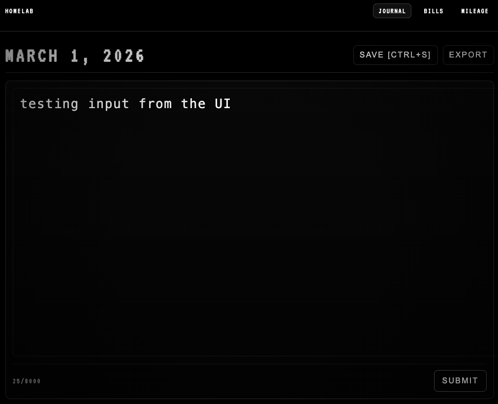

## Homelab – Personal Life Infrastructure

**Built and maintained by Santiago Ramos**  
Full Stack Engineer | Backend Systems

A self-hosted, containerized backend for managing personal data, analytics, and AI-powered insights.
Built as the foundation for a long-term “Life Terminal” system.

**Status:**  
Active Development | Self-Hosted | Dockerized | Production-Deployed  
FastAPI + Vue Web UI Live

## 🚀 Overview
Homelab is a self-hosted infrastructure project designed to centralize and manage personal life data — including finances, journal entries, expenses, health metrics, job tracking, and more. The system is designed with clear separation between development and production environments, emphasizing reproducibility, data durability, and secure remote access.

The goal is to build a production-grade backend architecture that:

- Runs locally and on a dedicated Ubuntu server
- Uses Docker for consistent environments
- Exposes a FastAPI backend
- Supports AI-powered insights
- Serves a Raspberry Pi touchscreen UI
- Is accessible securely over Tailscale

This project is both a practical tool and an ongoing exploration of backend architecture, containerization, and distributed personal systems.

## 🏗 Architecture
### Development Environment (macOS - Apple Silicon)
- macOS (Apple Silicon)
- Docker Desktop
- PostgreSQL (containerized)
- FastAPI backend container
- Vue 3 (Vite) web frontend
- Docker Compose with machine-specific overrides

### Production Environment (Ubuntu Server)
- Docker Engine
- Persistent database volumes stored on hardware
- Accessed securely via Tailscale VPN
- PostgreSQL 16 (bind-mounted to physical storage)
- FastAPI container
- Vue 3 web container (served via Vite)

### Planned Frontend Layer
- Raspberry Pi with HyperPixel 720x720 touchscreen
- UI served over Tailscale
- Potential mobile / web access

## 🧰 Tech Stack
### Current
- PostgreSQL 16
- FastAPI (Python)
- SQLAlchemy (ORM)
- Vue 3 + Vite
- Docker & Docker Compose
- Environment variable configuration via .env
- Tailscale VPN

### Planned
- AI integration for:
    - Data summaries
    - Pattern detection
    - Life analytics dashboards
- Raspberry Pi UI
- Mobile-accessible frontend
- Authentication layer
- Metrics & observability

## 📦 Repository Structure
```
homelab/
├── backend/
│ ├── app/
│ │ ├── db/
│ │ ├── models/
│ │ ├── schemas/
│ │ └── routers/
│ └── Dockerfile
├── frontend/
│ ├── web/ # Vue 3 browser UI (journal, bills, mileage, etc.)
│ └── kiosk/ # Future Raspberry Pi touchscreen UI
├── db/
│ └── init/ # SQL initialization scripts
├── docker-compose.yml
├── docker-compose.override.yml
├── .env
└── README.md
```

### Structure Overview
- **backend/** – FastAPI application and database models  
- **frontend/web/** – Vue 3 + Vite web UI  
- **frontend/kiosk/** – Dedicated UI for Raspberry Pi touchscreen (planned)  
- **db/init/** – SQL bootstrap scripts  
- **docker-compose.yml** – Base multi-service configuration  
- **docker-compose.override.yml** – Machine-specific overrides (dev vs server)

## ⚙️ Getting Started (Full Stack)
1. Clone the Repository
    ```bash
    git clone https://github.com/ChagoCruz/homelab.git
    cd homelab
    ```
2. Create Environment File
Create a .env file in the project root:
    ```env
    POSTGRES_DB=homelab
    POSTGRES_USER=homelab
    POSTGRES_PASSWORD=homelab
    ```

3. Build and Start All Services
    ```bash
    docker compose up -d --build
    ```
    - This will start:
        - PostgreSQL database
        - FastAPI backend
        - Vue 3 web frontend

4. Access the Application

    - ***API Docs(Swagger):***
        http://localhost:8000/docs
    
    - ***Web UI (Journal Page):***
        http://localhost:5173/journal

## 🖥 Web Interface (Journal Page)
Black-and-white retro terminal-inspired UI built with Vue 3.
<p align="center">
  
</p>


## 💾 Data Persistence Strategy
### Production (Ubuntu Server)
- Uses bind-mounted persistent storage on physical hardware
- Data stored on physical hardware
- Survives container restarts

### Development (macOS)
- Flexible configuration
- Can use ephemeral volumes for quick iteration
- Data durability is not required

This separation ensures:
Reliable production data
Fast and disposable development workflows

## 🔐 Remote Access
The production server is accessed securely using:

- Tailscale VPN
- SSH over private network
- Port-restricted database access
- No public database exposure

## 🧠 Long-Term Vision
Homelab is the backend foundation for a larger system:
The “Life Terminal”

A personal operating system that:
Tracks financial data
Stores journal entries
Manages job applications
Logs workouts and health metrics
Generates AI summaries and analytics
Runs on a dedicated Raspberry Pi touchscreen

Future goals include:
AI-driven dashboards
Natural language queries over life data
Intelligent daily summaries
Personal knowledge graph integration

## ✅ Current Capabilities
- Create and store journal entries via web UI
- Persistent PostgreSQL storage on production server
- Secure remote access via Tailscale
- Separate development and production configurations
- Containerized full-stack deployment

## 📈 Roadmap
 - [x] Dockerized PostgreSQL
 - [x] FastAPI backend container
 - [x] Vue 3 web frontend (Journal page)
 - [x] Production server deployment (Ubuntu + Tailscale)
 - [ ] Database schema versioning (Alembic)
 - [ ] Authentication layer
 - [ ] AI integration layer
 - [ ] Raspberry Pi kiosk UI
 - [ ] Mobile-optimized interface
 - [ ] Observability & metrics

## 🎯 Why This Project Exists
This project serves three purposes:
- Personal Infrastructure – Owning and understanding my own data systems
- Architectural Practice – Designing production-grade backend systems
- Continuous Learning – Exploring AI integration, containerization, and distributed self-hosted systems

It reflects a belief that software should empower individuals to build their own tools — not just consume them.


## 📄 License
