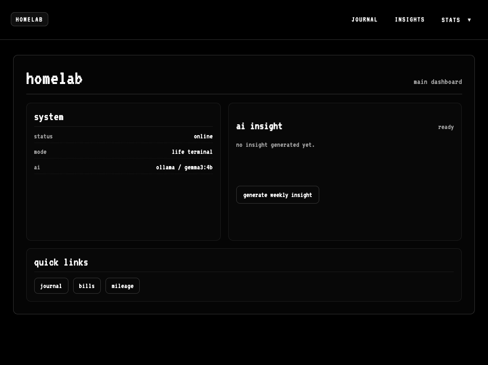
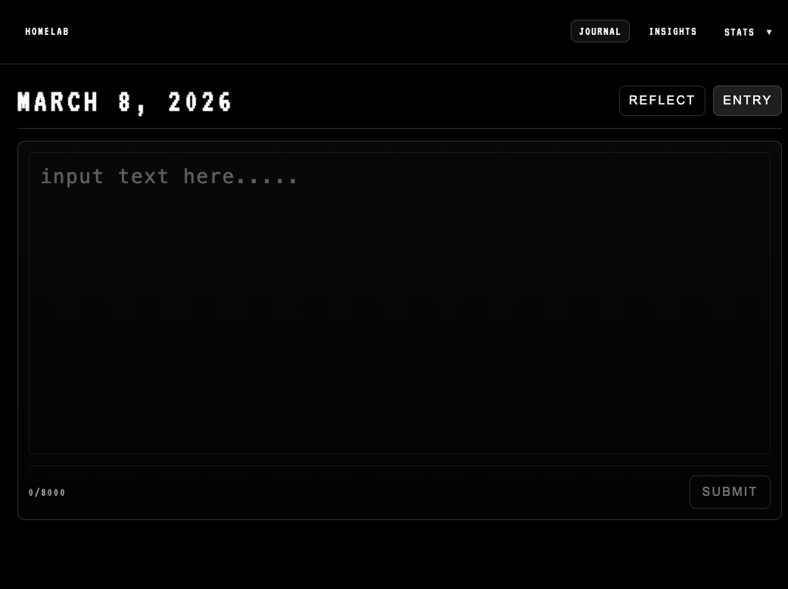
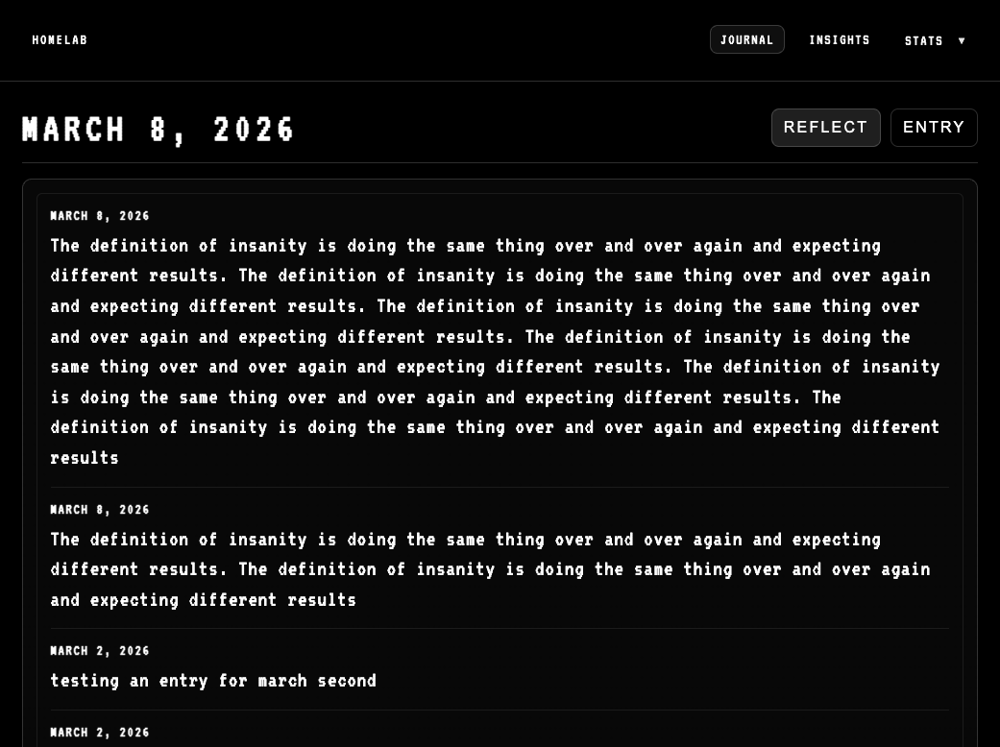
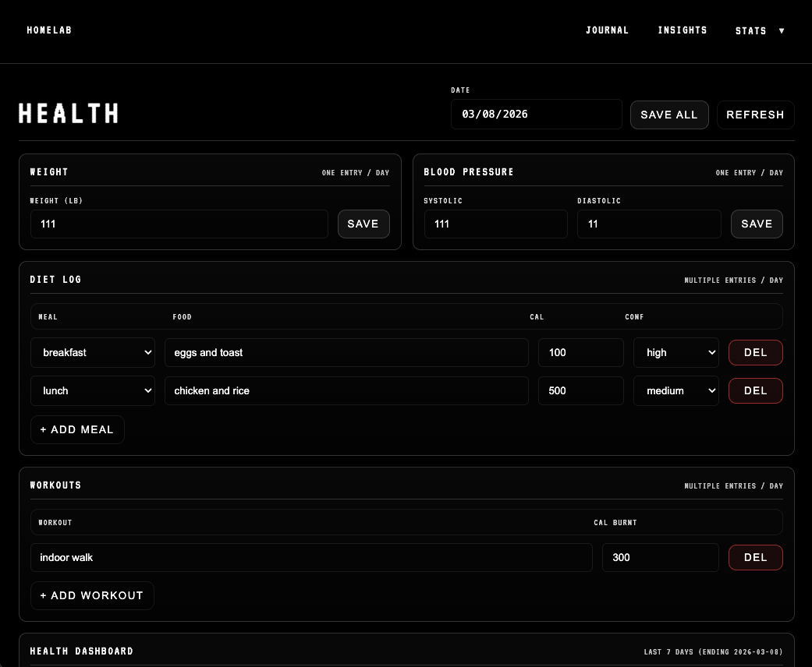

# Homelab – Personal Life Infrastructure


<p align="center">

</p>

A self-hosted platform for tracking and analyzing personal data such as finances, health, journaling, and productivity.

---

**Built and maintained by Santiago Ramos**  
Full Stack Engineer | Backend Systems

Homelab is the backend foundation for a long-term project called **Life Terminal** — a personal operating system for tracking and analyzing life data such as finances, health, journaling, and productivity.

The system is designed to run locally or on a private server using containerized infrastructure.

---

## 📑 Table of Contents

- [Overview](#-overview)
- [Features](#-features)
- [Architecture](#-architecture)
- [Tech Stack](#-tech-stack)
- [Repository Structure](#-repository-structure)
- [Getting Started](#-getting-started)
- [Example API Endpoints](#-example-api-endpoints)
- [Interface](#-interface)
- [Data Persistence Strategy](#-data-persistence-strategy)
- [Backup Strategy](#-backup-strategy)
- [Remote Access](#-remote-access)
- [Roadmap](#-roadmap)
- [Long-Term Vision](#-long-term-vision)
- [Engineering Concepts Demonstrated](#-engineering-concepts-demonstrated)
- [Why This Project Exists](#-why-this-project-exists)

---

## 🚀 Overview

Homelab is a **self-hosted personal data platform** that centralizes and analyzes everyday life information.

Instead of scattering data across dozens of apps, Homelab stores everything in a **single PostgreSQL database** exposed through a **FastAPI backend** and accessed through a **Vue 3 terminal-style interface**.

The system supports:

- Financial tracking
- Journaling
- Health metrics
- Mileage logging
- Diet tracking
- Life analytics dashboards

The goal is to build a **long-term personal infrastructure system** that can evolve with AI insights and advanced data analysis.

---

## ✨ Features

### Personal Data Tracking

Homelab currently supports:

- Journal entries
- Bills and recurring expenses
- Mileage tracking
- Health metrics
- Diet / calorie logging
- Personal life statistics

All data is stored in a centralized **PostgreSQL database** and exposed via a **REST API**.

---

### Analytics

Basic analytics dashboards are implemented in the UI:

- Weight trend tracking
- Calorie intake vs calories burned
- Life statistics summaries
- Personal health logs

Future versions will integrate **AI-generated insights and pattern detection**.

---

### Infrastructure

The system is designed as a **containerized full-stack application**.

Core infrastructure features:

- Dockerized services
- PostgreSQL database
- FastAPI backend
- Vue 3 frontend
- Environment-specific configs
- Secure remote access via Tailscale

The architecture allows the system to run identically on:

- macOS development machines
- Ubuntu production servers
- Raspberry Pi devices

---

## 🏗 Architecture

```
        ┌───────────────┐
        │   Web Browser │
        │ Vue 3 (Vite)  │
        └───────┬───────┘
                │
        ┌───────▼───────┐
        │   FastAPI API │
        │ Python + ORM  │
        └───────┬───────┘
                │
        ┌───────▼───────┐
        │ PostgreSQL 16 │
        │ Persistent DB │
        └───────────────┘
```

The application stack consists of three main components:

### Frontend

- Vue 3
- Vite
- Terminal-inspired UI

### Backend

- FastAPI
- SQLAlchemy ORM
- RESTful API

### Database

- PostgreSQL 16
- Persistent production storage
- SQL initialization scripts

---

## 🧰 Tech Stack

### Backend

- Python
- FastAPI
- SQLAlchemy
- PostgreSQL 16

### Frontend

- Vue 3
- Vite
- Responsive browser interface

### Infrastructure

- Docker
- Docker Compose
- Environment-based configuration
- Tailscale VPN for secure remote access

---

## 📦 Repository Structure

```
homelab/
│
├── backend/
│   ├── app/
│   │   ├── db/
│   │   ├── models/
│   │   ├── schemas/
│   │   └── routers/
│   │
│   └── Dockerfile
│
├── frontend/
│   ├── web/      # Vue browser UI
│   └── kiosk/    # Future Raspberry Pi UI
│
├── db/
│   └── init/     # Database initialization scripts
│
├── docker-compose.yml
├── docker-compose.override.yml
├── .env
└── README.md
```

### Structure Overview

- **backend/** – FastAPI application and API routes  
- **frontend/web/** – Vue 3 web interface  
- **frontend/kiosk/** – Future Raspberry Pi touchscreen UI  
- **db/init/** – SQL bootstrap scripts

---

## ⚙️ Getting Started

### 1️⃣ Clone the Repository

```bash
git clone https://github.com/ChagoCruz/homelab.git
cd homelab
```

---

### 2️⃣ Create Environment File

Create a `.env` file in the project root:

```
POSTGRES_DB=homelab
POSTGRES_USER=homelab
POSTGRES_PASSWORD=homelab

# Required for AI insight features
ANTHROPIC_API_KEY=your-key-here
```

---

### 3️⃣ Build and Start All Services

```bash
docker compose up -d --build
```

This will start:

- PostgreSQL database
- FastAPI backend
- Vue frontend

---

### 4️⃣ Access the Application

#### API Documentation

```
http://localhost:8000/docs
```

FastAPI automatically generates **interactive Swagger documentation**.

#### Web Interface

```
http://localhost:5173
```

---

## 🔌 Example API Endpoints

| Method | Endpoint | Description |
|------|------|------|
| GET | `/journal` | Fetch journal entries |
| POST | `/journal` | Create journal entry |
| GET | `/bills` | Retrieve recurring bills |
| POST | `/mileage` | Log mileage entry |
| GET | `/health` | Retrieve health metrics |

---

## 🖥 Interface

Terminal-inspired black-and-white interface built with Vue.

### Journal Pages

<table>
<tr>
<td align="center">
<b>Journal Entry</b><br>

</td>

<td align="center">
<b>Daily Reflection</b><br>

</td>
</tr>
</table>

### Health Page

<p align="center">

</p>

---

## 💾 Data Persistence Strategy

### Production (Ubuntu Server)

- PostgreSQL bind-mounted to physical storage
- Data stored outside containers
- Survives container rebuilds

### Development (macOS)

- Flexible volume configuration
- Disposable development environments
- Faster iteration

This separation ensures **safe production data and flexible development workflows**.

---

## 💾 Backup Strategy

Production database backups are performed using `pg_dump`.

Example:

```bash
sudo -u postgres pg_dump homelab > homelab_$(date +%Y-%m-%d).sql
```

Backups can be scheduled using **cron jobs**.

---

## 🔐 Remote Access

Production infrastructure is accessed securely using:

- Tailscale VPN
- SSH over private network
- Restricted database ports
- No public database exposure

To access the web UI from a remote host (e.g. via Tailscale), update `VITE_API_URL` in `frontend/web/.env` to the backend's reachable address:

```
VITE_API_URL=http://<your-server-ip>:8000
```

---

## 📈 Roadmap

### ✅ Completed

- Dockerized PostgreSQL database
- FastAPI backend container
- Vue 3 web UI
- Production deployment on Ubuntu server
- Secure access via Tailscale

### 🛠 Planned

- Database migrations with Alembic
- Authentication layer
- AI insights engine
- Raspberry Pi kiosk UI
- Mobile-optimized interface
- Observability & metrics

---

## 🧠 Long-Term Vision

Homelab is the backend infrastructure for **Life Terminal** — a personal operating system for life analytics.

Future capabilities include:

- AI-generated daily summaries
- Natural language queries over life data
- Long-term health and finance analytics
- Personal knowledge graph
- Dedicated Raspberry Pi touchscreen interface

The goal is to build a system that allows individuals to **own, analyze, and understand their own data**.

---

## 🧠 Engineering Concepts Demonstrated

This project explores several real-world backend and infrastructure concepts:

- Containerized full-stack architecture
- Stateful database management in Docker
- API-first backend design using FastAPI
- Environment-specific deployments (development vs production)
- Secure private infrastructure using Tailscale VPN
- Personal data modeling and relational schema design
- Designing analytics pipelines for life metrics

The project serves as a sandbox for experimenting with backend architecture patterns used in production systems.

---

## 🎯 Why This Project Exists

This project exists to explore:

- Self-hosted personal data infrastructure
- Full-stack containerized architectures
- Real-world API design
- AI integration with structured data
- Long-term personal analytics systems

It reflects the belief that **software should empower individuals to build their own tools — not just consume them.**

---

## 📄 License

MIT License